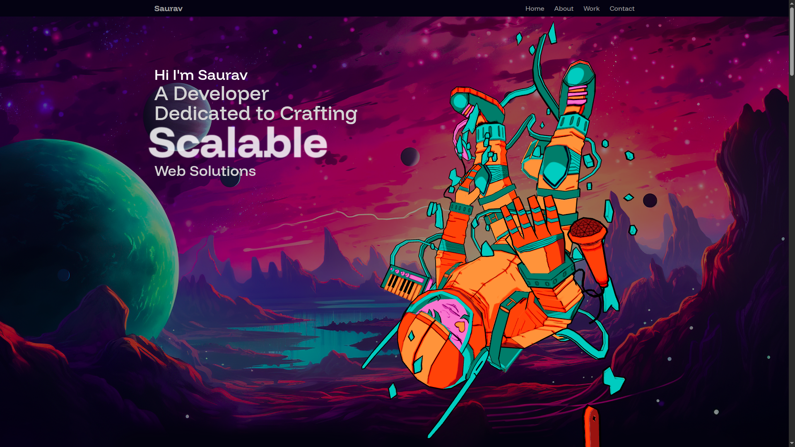

# 🌐 3D Portfolio Website

## 🖼️ Preview




An interactive 3D portfolio website built using cutting-edge tools like `Three.js`, `@react-three/fiber`, `Tailwind CSS v4`,and `Motion`. Designed for creative developers and designers who want to showcase their work with beautiful animations and modern UI.

---

## 🚀 Features

- 🌌 Real-time 3D scenes using `@react-three/fiber` and `three`
- ✨ Beautiful motion effects with `motion` and `@gsap/react`
- 📬 Contact form with EmailJS integration
- 🎨 Tailwind CSS v4 styling with `tailwind-merge`
- 🧩 Responsive layout using `react-responsive`
- 💫 Utility libraries like `maath`, `clsx`, and `cobe`
- 🔥 Developed with Vite for lightning-fast dev experience

---

## 📦 Dependencies

### Runtime

```json
{
  "@emailjs/browser": "^4.4.1",
  "@gsap/react": "^2.1.2",
  "@react-three/drei": "^10.5.1",
  "@react-three/fiber": "^9.2.0",
  "@tailwindcss/vite": "^4.0.7",
  "@types/three": "^0.173.0",
  "clsx": "^2.1.1",
  "cobe": "^0.6.4",
  "maath": "^0.10.8",
  "motion": "^12.23.6",
  "react": "^19.0.0",
  "react-dom": "^19.0.0",
  "react-responsive": "^10.0.1",
  "tailwind-merge": "^3.3.1",
  "tailwindcss": "^4.0.7",
  "three": "^0.173.0"
}
